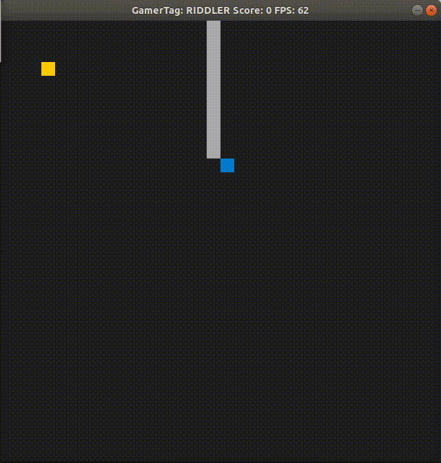

# CPPND: Capstone Snake Game Example
---
This is my repo for the Capstone project in the [Udacity C++ Nanodegree Program](https://www.udacity.com/course/c-plus-plus-nanodegree--nd213). The code for this repo was inspired by [this](https://codereview.stackexchange.com/questions/212296/snake-game-in-c-with-sdl) excellent StackOverflow post and set of responses.

The Capstone Project gives you a chance to integrate what you've learned throughout this program. This project will become an important part of your portfolio to share with current and future colleagues and employers.

In this project, you can build your own C++ application or extend this Snake game, following the principles you have learned throughout this Nanodegree Program. This project will demonstrate that you can independently create applications using a wide range of C++ features.

---
## Dependencies for Running Locally
---
* cmake >= 3.7
  * All OSes: [click here for installation instructions](https://cmake.org/install/)
* make >= 4.1 (Linux, Mac), 3.81 (Windows)
  * Linux: make is installed by default on most Linux distros
  * Mac: [install Xcode command line tools to get make](https://developer.apple.com/xcode/features/)
  * Windows: [Click here for installation instructions](http://gnuwin32.sourceforge.net/packages/make.htm)
* SDL2 >= 2.0
  * All installation instructions can be found [here](https://wiki.libsdl.org/Installation)
  >Note that for Linux, an `apt` or `apt-get` installation is preferred to building from source. 
* gcc/g++ >= 5.4
  * Linux: gcc / g++ is installed by default on most Linux distros
  * Mac: same deal as make - [install Xcode command line tools](https://developer.apple.com/xcode/features/)
  * Windows: recommend using [MinGW](http://www.mingw.org/)
---
## Basic Build Instructions
---
1. Clone this repo.
2. Make a build directory in the top level directory: `mkdir build && cd build`
3. Compile: `cmake .. && make`
4. Run it: `./SnakeGame <gamertag>`.
   1. Replace `<gamertag>` with your name.
5. To see help: `./SnakeGame --help`

---
## Description
---
This is the classic Snakes game with a little added twist. 

#### Features: 
- To run the game, player has to provide their `<gamertag>` which will keep track of their score and will maintain their best score. When the game starts, the snake starts in the middle and there is a food placed in the game. 

- There is now a wall placed randomely in the game as well which the snake has to avoid because if it collides with the wall, it will die and the game will end.

---
## Rubric Points
---
#### Loops, Functions, I/O

The project demonstrates an understanding of C++ functions and control structures. This project contains loops, functions, and I/O systems which demonstrate this understanding.
- Functions: 
  - The scoring.cpp file has multiple setter and getter functions to set or get the values of name and score of the player.
  - It also consists of Read and Write function to read/write the player scores into the score sheet.
- Loops:
  - The scoring.cpp file uses for loop in line number 49 to write each score into the score sheet.
  - It also uses while loops in line numbers 93 and 96 to read the scores from the score sheet.
  - game.cpp also uses for loop in line number 61 to generate walls in the game.
- I/O:
  - The game also takes an argument as input named `gamertag` and uses it to display it on the game window as well as save the players top score in the score sheet.

#### Object Oriented Programming
- The project uses Object Oriented Programming techniques. The project code is organized into classes with class attributes to hold the data, and class methods to perform tasks. scoring.cpp uses class and it's methods to demonstrate object oriented programming techniques.
- The class uses access specifiers such as private and public keywords.
- Constructor is used to initialise default values of score and name of the player in line number 11.
- Comments are used to describe what a block of code is doing.

---

## CC Attribution-ShareAlike 4.0 International

Shield: [![CC BY-SA 4.0][cc-by-sa-shield]][cc-by-sa]

This work is licensed under a
[Creative Commons Attribution-ShareAlike 4.0 International License][cc-by-sa].

[![CC BY-SA 4.0][cc-by-sa-image]][cc-by-sa]

[cc-by-sa]: http://creativecommons.org/licenses/by-sa/4.0/
[cc-by-sa-image]: https://licensebuttons.net/l/by-sa/4.0/88x31.png
[cc-by-sa-shield]: https://img.shields.io/badge/License-CC%20BY--SA%204.0-lightgrey.svg
